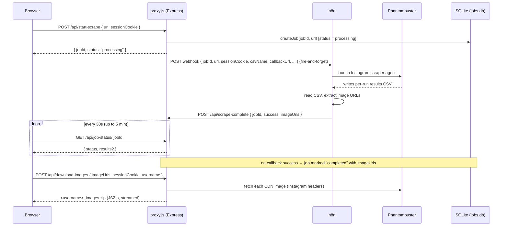

# IG Phantom — Instagram Profile Scraper

A self-hosted web app that scrapes the images from a public Instagram profile (via **Phantombuster**, launched through an **n8n** workflow) and lets you download them as a ZIP.

The browser never talks to Instagram or Phantombuster directly. A small Node.js/Express backend orchestrates an **async job**: it kicks off the scrape, stores progress in SQLite, receives a callback with the image URLs when n8n finishes, and finally downloads + zips the images server-side (with proper Instagram headers) so the browser avoids CORS and hotlink-protection problems.

> ⚠️ This is **not a standalone app** — it depends on two external services you must operate yourself: an **n8n** instance with a scraper workflow, and a **Phantombuster** account/agent. See [Prerequisites](#prerequisites).

---

## Table of Contents

- [What it does](#what-it-does)
- [Architecture](#architecture)
- [End-to-end flow](#end-to-end-flow)
- [Tech stack](#tech-stack)
- [Project structure](#project-structure)
- [Prerequisites](#prerequisites)
- [Configuration (`.env`)](#configuration-env)
- [Running](#running)
- [API reference](#api-reference)
- [Data model](#data-model)
- [How scraping actually works (the `csvName` requirement)](#how-scraping-actually-works-the-csvname-requirement)
- [Troubleshooting](#troubleshooting)
- [Operational notes & caveats](#operational-notes--caveats)
- [Development & testing](#development--testing)
- [Security](#security)

---

## What it does

1. You enter an Instagram profile URL (and optionally an Instagram `sessionid` cookie for better results).
2. The server starts an asynchronous scrape job and immediately returns a `jobId`.
3. n8n launches your Phantombuster Instagram scraper, which writes results to a per-run CSV.
4. n8n reads that CSV, extracts the image URLs, and POSTs them back to this server.
5. You poll for status; when the job completes you see a summary (image count, estimated size, URL preview).
6. You click **Download All as ZIP** — the server fetches each image with browser-like Instagram headers, packages them into `<username>_images.zip`, and streams it to you.

---

## Architecture

```
                       ┌─────────────────────────────┐
   Browser (index.html)│   Node.js / Express (proxy.js)   │
        │              │   - async job orchestration       │
        │  /api/*      │   - SQLite job store (jobs.db)    │
        └──────────────►│   - server-side image download    │
                       └───────────┬─────────────────────┘
                                   │ 1. POST {url, sessionCookie, csvName, ...}
                                   ▼
                          ┌───────────────────┐
                          │   n8n workflow    │  (your n8n instance)
                          │  webhook trigger  │
                          └─────────┬─────────┘
                                    │ 2. launch agent
                                    ▼
                          ┌───────────────────┐
                          │   Phantombuster   │  (your account/agent)
                          │  Instagram scraper│
                          └─────────┬─────────┘
                                    │ 3. results CSV (per-run name)
                                    ▼
                          ┌───────────────────┐
                          │   n8n reads CSV,  │
                          │  extracts URLs    │
                          └─────────┬─────────┘
                                    │ 4. POST imageUrls → /api/scrape-complete
                                    ▼
                       ┌─────────────────────────────┐
                       │   proxy.js marks job done;   │
                       │   on download, fetches CDN   │
                       │   images → ZIP → browser     │
                       └─────────────────────────────┘
```

**Why a backend proxy at all?** The browser can't call the n8n webhook directly — it's cross-origin (no CORS header on the webhook) and scrapes take minutes, far longer than the browser's request timeout. So `proxy.js` makes those calls server-to-server and exposes same-origin `/api/*` endpoints to the frontend.

---

## End-to-end flow



**Key points:**
- The initial request to n8n is **fire-and-forget** — `proxy.js` does not wait for the scrape. Completion arrives via the `/api/scrape-complete` callback.
- The frontend **polls** `/api/job-status/:jobId` every 30 seconds (5-minute hard timeout on the client).
- The image **download** is a separate, on-demand step triggered by the user clicking the download button.

---

## Tech stack

| Layer | Technology |
|---|---|
| Runtime | Node.js 18 (`node:18-alpine3.19`) |
| Web framework | Express 4 |
| Job store | SQLite via `better-sqlite3` (rebuilt from source in the Alpine image) |
| HTTP client | `node-fetch` |
| ZIP | `jszip` (server-side) |
| Frontend | Single-page `index.html`, vanilla JS, Tailwind via CDN |
| Container | Docker / docker-compose |

Dependencies are declared in `package.json` and installed inside the image via `npm install --production`.

---

## Project structure

**Active files:**

```
ig_phantom/
├── proxy.js            # Express app — all /api/* endpoints + orchestration
├── database.js         # JobDatabase (better-sqlite3) wrapper
├── schema.sql          # scraping_jobs table + indexes
├── index.html          # SPA frontend
├── favicon.svg
├── package.json        # dependencies + scripts (start / dev)
├── package-lock.json
├── Dockerfile          # node:18-alpine3.19 → npm install → node proxy.js
├── docker-compose.yml  # service "frontend", expose 3000, shared_net, env_file, healthcheck
├── .env                # SECRETS (gitignored) — see Configuration
├── .gitignore
└── .dockerignore
```

**Legacy / not used by the current runtime** (kept for history; safe to ignore or remove):
- `Dockerfile.simple`, `substitute-env.sh` — leftovers from the previous **nginx-static** architecture (the app no longer uses nginx or `envsubst`).
- `index-download-focused.html`, `index-fixed.html` — older copies of the frontend.
- `tests/frontend-diagnosis.html` — a one-off diagnostic page.
- `docs/` — historical notes from the CORS/proxy migration; partially outdated.

---

## Prerequisites

You need to operate these yourself — this repo is just the frontend + orchestration layer.

1. **Docker** + **docker compose**, on a host connected to a Docker network named `shared_net` (create it once: `docker network create shared_net`).
2. **An n8n instance** with a workflow exposed at a webhook URL. This server POSTs a JSON payload to it (see [How scraping works](#how-scraping-actually-works-the-csvname-requirement)). The workflow is responsible for:
   - launching your Phantombuster agent with the scraping parameters (it passes `csvName` through **verbatim**),
   - reading the resulting CSV,
   - POSTing the extracted image URLs back to the `callbackUrl`.
3. **A Phantombuster account + Instagram scraper agent** (`AGENT_ID`). Its API key goes in `.env`.
4. **A reverse proxy** (e.g. nginx Proxy Manager) terminating TLS and forwarding to the container's port 3000 — the container only exposes the port on the Docker network; it is not published to the host.

> **Hardcoded values to update when forking** (in `proxy.js`):
> - The **n8n webhook URL** in `startN8NProcessing` — currently `https://n8n.gemneye.info/webhook/instagram-scraper`.
> - The **CORS allowed origins** in the `cors()` middleware — currently `https://igphantom.gemneye.info`, `http://localhost:3000`, `http://127.0.0.1:3000`. Add your own origin(s).
>
> `CALLBACK_BASE_URL` (the public origin n8n calls back to) *is* configurable via `.env` — see [Configuration](#configuration-env).

---

## Configuration (`.env`)

Copy `.env.example` if present, otherwise create `.env` with:

```dotenv
# Phantombuster credentials
PHANTOMBUSTER_API_KEY=your_phantombuster_api_key
AGENT_ID=your_phantombuster_agent_id

# How many posts to request per profile (default 100)
POSTS_PER_PROFILE=200

# Port the Express server listens on inside the container (default 3000)
PORT=3000

# Public base URL where THIS server is reachable, so n8n can call back.
# Defaults to http://localhost:${PORT}. In production set it to your public origin, e.g.:
# CALLBACK_BASE_URL=https://igphantom.example.com
CALLBACK_BASE_URL=
```

These are injected into the container via docker-compose's `env_file: .env`. **`.env` is gitignored** — never commit it.

---

## Running

```bash
# Build and start (code is baked into the image, so rebuild after code changes)
docker compose up -d --build frontend

# Tail logs
docker compose logs -f frontend

# Status
docker compose ps

# Apply only .env changes (no rebuild needed)
docker compose restart frontend
```

The app listens on port **3000 inside the container**, exposed on the `shared_net` Docker network. Reach it through your reverse proxy (e.g. `https://igphantom.example.com`). Health check: `GET /health` → `{"status":"ok"}`.

### Optional: run locally without Docker

```bash
npm install      # node_modules is NOT in the repo
npm start        # node proxy.js
# npm run dev    # with nodemon (auto-reload)
```

---

## API reference

| Method | Path | Purpose |
|---|---|---|
| `GET` | `/health` | Health check → `{ status: "ok", timestamp }` |
| `GET` | `/favicon.ico` | Serves `favicon.svg` with the correct MIME type |
| `POST` | `/api/start-scrape` | Start an async scrape. Body: `{ url, sessionCookie? }`. Returns `{ jobId, status: "processing" }`. |
| `GET` | `/api/job-status/:jobId` | Poll a job. Returns `{ jobId, status, url, createdAt, completedAt, results?, totalImages?, error? }`. |
| `POST` | `/api/scrape-complete` | **n8n callback.** Body: `{ jobId, success, imageUrls, totalImages, error }`. Tolerates n8n's leading `=` on values; `imageUrls` may be a comma-separated string. |
| `POST` | `/api/download-images` | Download + zip. Body: `{ imageUrls, sessionCookie?, username? }`. Returns a ZIP (`application/zip`) named `<username>_images.zip`. |

**Job statuses:** `processing` → `completed` (with `results.imageUrls`) | `failed` (with `error_message`).

---

## Data model

SQLite database at `/app/jobs.db` **inside the container** (see [caveats](#operational-notes--caveats)).

```sql
CREATE TABLE scraping_jobs (
    id             TEXT PRIMARY KEY,        -- UUID per job
    status         TEXT NOT NULL DEFAULT 'processing',  -- processing | completed | failed
    url            TEXT NOT NULL,           -- the Instagram profile URL
    session_cookie TEXT,
    created_at     DATETIME DEFAULT CURRENT_TIMESTAMP,
    completed_at   DATETIME,
    results        TEXT,                    -- JSON: { success, imageUrls[], totalImages, timestamp }
    error_message  TEXT                     -- e.g. "=No new posts found"
);
```

Query it inside the container:
```bash
docker exec instagram_scraper_ui sqlite3 -header -column /app/jobs.db \
  "SELECT substr(id,1,8) id, status, substr(url,1,30) url, created_at,
          substr(COALESCE(error_message,'(null)'),1,60) err
   FROM scraping_jobs ORDER BY created_at DESC LIMIT 10;"
```

---

## How scraping actually works (the `csvName` requirement)

When `proxy.js` calls n8n, the payload includes a `csvName`:

```js
csvName: `instagram_${jobId.replace(/-/g, '')}`   // e.g. instagram_b32a9efc…
numberOfPostsPerProfile: parseInt(process.env.POSTS_PER_PROFILE) || 100,
numberOfProfilesPerLaunch: 1,
```

**This value must be unique per run.** Phantombuster *appends* to the named CSV across launches and the agent *dedupes* new posts against the CSV's existing contents. A fixed `csvName` therefore makes re-scrapes return **"No new posts found"** — which fails the job before any image is ever downloaded. The per-`jobId` name guarantees each run gets a fresh, isolated CSV. (This was the root cause of a prior outage; see git history for the fix.)

---

## Troubleshooting

| Symptom | Likely cause | Fix |
|---|---|---|
| Job fails with **`=No new posts found`** | `csvName` collided with a previous run (CSV append+dedup) | Ensure `csvName` is unique per run (it is in current code). Optionally delete old accumulated CSVs in Phantombuster. |
| Job fails with **`=Page isn't available`** (profile exists & is public) | Phantombuster proxy / session-cookie problem (IP-region mismatch, datacenter/blacklisted proxy, stale `sessionid`) | Configure a **residential, sticky, region-matched** proxy in the Phantombuster agent; refresh the Instagram `sessionid`. This is upstream of this codebase. |
| ZIP contains `FAILED_*.txt` files | Some CDN images were blocked during download | Often rate-limiting; retry, or supply a valid `sessionCookie`. |
| `curl localhost:3000` fails from host | Port is **exposed**, not published | Expected — reach it via the reverse proxy / Docker network, or `docker exec … wget`. |
| Changes don't take effect | Code is baked into the image | `docker compose up -d --build frontend` |
| Logs look empty / stale | Docker log retention | `docker compose logs -f frontend`; query `jobs.db` for ground-truth job state. |

The leading `=` on error messages is an artifact of n8n's expression engine (the value passed through `=`-prefixed). `proxy.js` strips it from `jobId`/`success`/`imageUrls` but not from `error`.

---

## Operational notes & caveats

- **`jobs.db` is ephemeral.** It lives at `/app/jobs.db` inside the container with **no volume mount**. Rebuilding/recreating the container wipes job history. If you need persistence, add a volume for the DB (the Dockerfile pre-creates `/app/data`) and point `database.js` at it.
- **Code is baked into the image.** There is no code volume; any change to `proxy.js`/`index.html`/etc. requires a rebuild.
- **Port topology.** Port 3000 is `expose`d on `shared_net`, not published to the host. Traffic reaches the app through an external reverse proxy.
- **`numberOfProfilesPerLaunch` is hardcoded to 1** (single profile per launch).
- **The frontend's "estimated size"** is a rough heuristic (~0.5 MB/image), not a real measurement.

---

## Development & testing

- **No automated test suite.** There are no unit/integration tests covering the backend logic — `database.js` methods and route handlers are untested. The tracked `tests/frontend-diagnosis.html` is a manual browser diagnostic page, not a test harness. Verify changes by running the container and exercising the endpoints end-to-end.
- **`database.js` exposes two unused methods** — `getJobsByStatus(status)` and `cleanup(olderThanDays = 7)` — defined but not wired to any route or scheduler. Auto-cleanup isn't scheduled (and is largely moot while `jobs.db` is ephemeral — see [caveats](#operational-notes--caveats)); call them yourself if you mount a persistent DB.
- **Startup behavior:** if SQLite initialization fails on boot, the process exits with code 1 (`process.exit(1)`).
- **n8N call timing:** `startN8NProcessing` POSTs to n8n with a short client timeout and treats `ETIMEDOUT` as expected (fire-and-forget) — a "timeout" there is normal, not an error.
- **Local dev:** `npm install && npm run dev` (nodemon auto-reload). Logs are emoji-tagged (🚀 📥 📡 ⬇️ ❌), easy to filter in `docker compose logs -f frontend`.

---

## Security

- `.env` (Phantombuster API key, session cookies) is in `.gitignore` and `.dockerignore` — keep it that way. **Never commit secrets.**
- If a key is ever exposed (e.g. committed to a public repo), **rotate it immediately** on Phantombuster and treat any committed session cookies as compromised. Removing the file from future commits does not erase it from git history.
- The container runs the Express app directly; ensure your reverse proxy provides TLS and appropriate access controls in front of it.
- Only public Instagram profile data is scraped; a `sessionid` cookie (optional) is forwarded to improve results and is stored only transiently on the job row.
